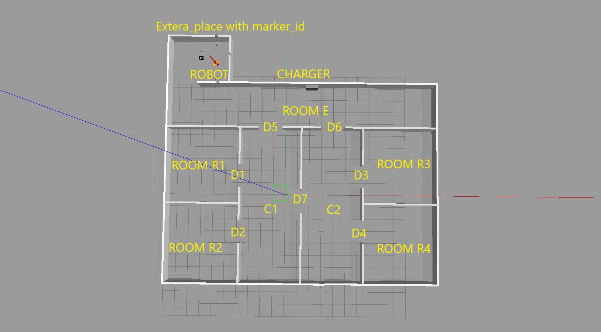

Map
==========

Environment
------------

The whole structure of the map is the following one. There are 5 rooms( #E, #R1, #R2, #R3, #R4) and 2 corridors (#C1, #C2).
In the beginning, the robot was placed in an extra place in room E and started working since the arm movement state is *True*,
the robot base doesn't move. When all markers are detected by the robot camera arm state becomes *False*. There are 7 markers
on the map and each one has an id number to identify one room. The robot can access each room through the doors. All information
about the room is available in marker_server.cpp and FSM node use those information to find out the connection between the rooms.
After that robot starts patrolling the map. There is a charger placed in room E, each time the battery level is lower than the 
threshold robot goes into room E to charge.

SMACH viewer
------------

A few seconds after launching **smach viewer ** appears and starts working. 

1. SETUP_MAP: 
  It happens just at the beginning when the robot finds the marker id, adds them to the list, and via id number finds room information.
  When all markers are detected smach changes state.

2. GO_IN_ROOM:
  This state has a main function between smash states. When this state starts battery level starts consuming, use ontology map information
  and update target_room and battery_level. The robot starts moving in the map by using *MoveBaseAction* and tries to reach the target room
  indicated in the ontology map, the method to choose which room the robot has to time visit is last_visited_time, which means how much time
  pass respect last time robot was there. Meanwhile battery level is under control and if it's lower than the threshold (300%) the target_room
  becomes room E and the state change to the GO_TO_CHARGER. Otherwise, if robot reaches the center of the target_room the state changes to INSCPET_ROOM.

3. INSCPET_ROOM: 
  Although the center of the room is reached by the robot, the base_movement_state becomes *False* and the arm_movement_state becomes *True*.
  The robot base is fixed at the room center and the robot arm starts moving around and gets the same configuration as the beginning
  (finding marker_id) after that finished exploring smach state becomes GO_IN_ROOm again and the base/arm state is switched.

4. GO_TO_CHARGER:
  When receiving a message that battery_level is low, room E becomes the first URGENT case to visit and the robot moves there. 

5. WAIT_FOR_CHARGING:
  When the robot reached room E, wait there for 5 secs to charge the battery and the battery level becomes (1500%). The base/arm state are *False*.
  Ather finished battery charging state changed again to GO_IN_ROOM and start patrolling on the map.

.. image:: image/smach.jpg
  :width: 1000
  :align: center
  :alt: smach.jpg